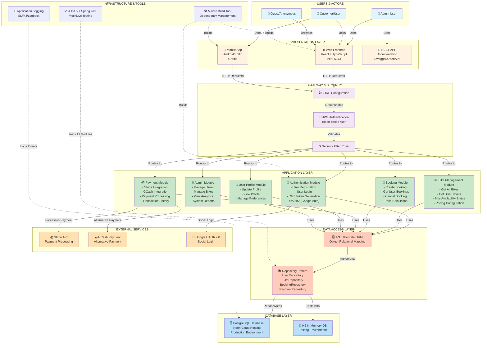

# eBike Rental System - Architecture Diagram

## System Overview



---

## Architecture Components Breakdown

### 1. **Users & Actors**
- **Admin Users**: Manage system, view analytics, manage bikes and users
- **Customers/Registered Users**: Rent bikes, make payments, view booking history
- **Guest Users**: Browse available bikes (limited access)

### 2. **Presentation Layer**
| Component | Technology | Purpose |
|-----------|-----------|---------|
| **Web Frontend** | React 18 + TypeScript + Tailwind | User-facing web interface on port 5173 |
| **Mobile App** | Android/Kotlin + Gradle | Native mobile app for on-the-go access |
| **API** | REST API + Swagger | API documentation and testing interface |

### 3. **Gateway & Security Layer**
| Component | Function |
|-----------|----------|
| **CORS Configuration** | Cross-Origin Resource Sharing for frontend access |
| **JWT Authentication** | Token-based authentication for secure requests |
| **Security Filter Chain** | Spring Security filters for endpoint authorization |

### 4. **Application Layer (Core Business Logic)**

#### Authentication Module (`/auth`)
- User registration with email validation
- User login with JWT token generation
- OAuth2 integration with Google
- Token refresh and validation

#### Bike Management Module (`/bikes`)
- Display all available bikes with filters
- Get detailed bike information
- Check bike availability status
- Display pricing (hourly & daily rates)
- Manage bike inventory

#### Booking Module (`/bookings`)
- Create new bike reservations
- View user's booking history
- Calculate rental prices based on duration
- Handle booking cancellations
- Manage booking status (PENDING, CONFIRMED, COMPLETED, CANCELLED)

#### Payment Module (`/payments`)
- Process payments via Stripe
- Process payments via GCash
- Store transaction history
- Handle payment failures and retries
- Generate payment receipts

#### User Profile Module (`/profile`)
- Update user information
- View profile details
- Manage saved payment methods
- Update preferences

#### Admin Module (`/admin`)
- Manage users (view, edit, deactivate)
- Manage bikes (create, update, delete)
- View system analytics
- Generate reports
- Access control management

### 5. **Data Access Layer**
| Technology | Purpose |
|-----------|---------|
| **JPA/Hibernate** | Object-Relational Mapping (ORM) framework |
| **Repository Pattern** | Data access abstraction layer |

**Repositories:**
- UserRepository
- BikeRepository
- BookingRepository
- PaymentRepository

### 6. **Database Layer**

#### Production Database
- **PostgreSQL** hosted on **Neon** (Cloud Database)
- Tables:
  - `users` - User accounts and authentication
  - `bikes` - Bike inventory and specifications
  - `bookings` - Rental reservations
  - `payments` - Payment transactions
  - `bike_maintenance` - Service records

#### Testing Database
- **H2 In-Memory Database** - For unit and integration tests
- Automatically created during test runs
- Configured with `create-drop` DDL strategy

### 7. **External Services Integration**

| Service | Purpose | Integration |
|---------|---------|-------------|
| **Stripe** | Credit card payments | Payment processing API |
| **GCash** | Mobile payment | Alternative payment method |
| **Google OAuth 2.0** | Social authentication | User login with Google account |

### 8. **Infrastructure & Tools**

| Tool | Purpose |
|-----|---------|
| **Maven (mvnw)** | Build automation and dependency management |
| **Spring Boot 3.5.11** | Framework for backend application |
| **Java 17** | Programming language |
| **JUnit 5** | Unit testing framework |
| **MockMvc** | Testing REST controllers |
| **SLF4J/Logback** | Application logging |
| **Spring Security** | Authentication and authorization |

---

## Data Flow Example: Bike Booking Flow

```
1. User logs in
   └─> JWT Token received
   
2. User browses bikes
   └─> BikeController.getAllBikes()
   └─> BikeRepository queries PostgreSQL
   └─> Bikes data returned to frontend
   
3. User creates booking
   └─> BookingController.createBooking()
   └─> BookingService calculates price
   └─> Booking saved to PostgreSQL
   
4. User pays
   └─> PaymentController processes payment
   └─> PaymentService calls Stripe/GCash API
   └─> Transaction recorded in PostgreSQL
   
5. Booking confirmed
   └─> Email confirmation sent
   └─> Bike status updated to RENTED
```

---

## Technology Stack Summary

**Backend:**
- Java 17 + Spring Boot 3.5.11
- Spring Security + JWT
- Spring Data JPA + Hibernate
- PostgreSQL (Neon)

**Frontend:**
- React 18 + TypeScript
- Tailwind CSS
- Vite (build tool)

**Mobile:**
- Android (Kotlin)
- Gradle

**DevOps & Testing:**
- Maven build tool
- JUnit 5 + Spring Test
- H2 in-memory database for tests
- Git version control

**Payment Integration:**
- Stripe API
- GCash API

---

## System Security Features

✅ JWT Token-based authentication
✅ Spring Security filter chain
✅ Password encryption (BCrypt)
✅ CORS protection
✅ CSRF disabled for stateless API
✅ Role-based access control (ADMIN, USER roles)
✅ Input validation on all endpoints
✅ Secure payment processing

---

## Deployment & Port Configuration

| Component | Port | Environment |
|-----------|------|-------------|
| Web Frontend | 5173 | Development |
| Backend API | 8083 | Production (Neon) |
| Backend API | 8080/8081 | Development/Testing |
| PostgreSQL | 5432 | Cloud (Neon) |

---

*Last Updated: May 11, 2026*
*Architecture Version: 1.0*
